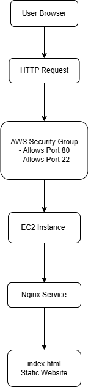

# 🚀 AWS EC2 Nginx Production Deployment

Provisioned and configured a production-ready Linux web server on AWS EC2, deployed using Nginx and secured via proper networking configuration.

---

## 📌 Project Overview

This project demonstrates provisioning and configuring a cloud-based Linux server on AWS EC2, installing and configuring Nginx, and deploying a custom static website.

- Hands-on infrastructure provisioning in cloud environment
- Linux server administration
- Networking and security configuration
- Web server deployment
- Infrastructure troubleshooting
- Documentation

---

## 🏗 Architecture



**Flow:**

User Browser → HTTP Request → AWS Security Group → AWS EC2 (Ubuntu 22.04) → Nginx → Static HTML Website

---

## ⚙️ Tech Stack

| Category | Technology |
|----------|------------|
| Cloud Provider | AWS |
| Compute | EC2 |
| OS | Ubuntu 22.04 LTS |
| Web Server | Nginx |
| Access Method | SSH |
| Networking | Security Groups (Port 22 & 80) |

---

## 🚀 Deployment Process

### 1️⃣ Launch EC2 Instance

- Ubuntu 22.04 LTS
- t2.micro
- Configured Security Group:
  - SSH (22) → My IP
  - HTTP (80) → 0.0.0.0/0

---

### 2️⃣ Connect to Server via SSH

```bash
chmod 400 key.pem
ssh -i key.pem ubuntu@<public-ip>
```
---

### 3️⃣ Install Nginx

```bash 
sudo apt update
sudo apt install nginx -y
sudo systemctl start nginx
sudo systemctl enable nginx
```
